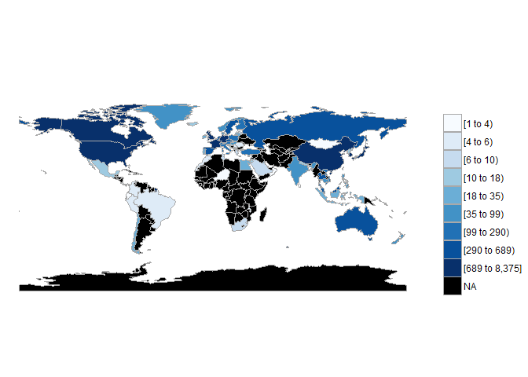

106-2 大數據分析方法 作業二
================
楊兆寧

作業完整說明[連結](https://docs.google.com/document/d/1aLGSsGXhgOVgwzSg9JdaNz2qGPQJSoupDAQownkGf_I/edit?usp=sharing)

學習再也不限定在自己出生的國家，台灣每年有許多學生選擇就讀國外的大專院校，同時也有人多國外的學生來台灣就讀，透過分析[大專校院境外學生人數統計](https://data.gov.tw/dataset/6289)、[大專校院本國學生出國進修交流數](https://data.gov.tw/dataset/24730)、[世界各主要國家之我國留學生人數統計表](https://ws.moe.edu.tw/Download.ashx?u=C099358C81D4876CC7586B178A6BD6D5062C39FB76BDE7EC7685C1A3C0846BCDD2B4F4C2FE907C3E7E96F97D24487065577A728C59D4D9A4ECDFF432EA5A114C8B01E4AFECC637696DE4DAECA03BB417&n=4E402A02CE6F0B6C1B3C7E89FDA1FAD0B5DDFA6F3DA74E2DA06AE927F09433CFBC07A1910C169A1845D8EB78BD7D60D7414F74617F2A6B71DC86D17C9DA3781394EF5794EEA7363C&icon=..csv)可以了解103年以後各大專院校國際交流的情形。請同學分析以下議題，並以視覺化的方式呈現分析結果，呈現103年以後大專院校國際交流的情形。

來台境外生分析
--------------

### 資料匯入與處理

``` r
library(readr)
library(jsonlite)
library(curl)
```

    ## 
    ## Attaching package: 'curl'

    ## The following object is masked from 'package:readr':
    ## 
    ##     parse_date

``` r
library(dplyr)
```

    ## 
    ## Attaching package: 'dplyr'

    ## The following objects are masked from 'package:stats':
    ## 
    ##     filter, lag

    ## The following objects are masked from 'package:base':
    ## 
    ##     intersect, setdiff, setequal, union

``` r
library(ggplot2)
library(choroplethr)
```

    ## Loading required package: acs

    ## Loading required package: stringr

    ## Loading required package: XML

    ## 
    ## Attaching package: 'acs'

    ## The following object is masked from 'package:dplyr':
    ## 
    ##     combine

    ## The following object is masked from 'package:base':
    ## 
    ##     apply

``` r
country103<-fromJSON("https://quality.data.gov.tw/dq_download_json.php?nid=6289&md5_url=25f64d5125016dcd6aed42e50c972ed0")
school103<-fromJSON("https://quality.data.gov.tw/dq_download_json.php?nid=6289&md5_url=a6d1469f39fe41fb81dbfc373aef3331")
country104<-fromJSON("https://quality.data.gov.tw/dq_download_json.php?nid=6289&md5_url=4d3e9b37b7b0fd3aa18a388cdbc77996")
school104<-fromJSON("https://quality.data.gov.tw/dq_download_json.php?nid=6289&md5_url=8baeae81cba74f35cf0bb1333d3d99f5")
country105<-fromJSON("https://quality.data.gov.tw/dq_download_json.php?nid=6289&md5_url=19bedf88cf46999da12513de755c33c6")
school105<-fromJSON("https://quality.data.gov.tw/dq_download_json.php?nid=6289&md5_url=1a485383cf9995da679c3798ab4fd681")
country106<-fromJSON("https://quality.data.gov.tw/dq_download_json.php?nid=6289&md5_url=50e3370f9f8794f2054c0c82a2ed8c91")
school106<-fromJSON("https://quality.data.gov.tw/dq_download_json.php?nid=6289&md5_url=883e2ab4d5357f70bea9ac44a47d05cc")
```

### 哪些國家來台灣唸書的學生最多呢？

``` r
for(i in 3:11){
  country103[,i]<-as.numeric(country103[,i])
  country104[,i]<-as.numeric(country104[,i])
  country105[,i]<-as.numeric(country105[,i])
  country106[,i]<-as.numeric(country106[,i])
}
country103$total103<-rowSums(country103[,3:11])
country104$total104<-rowSums(country104[,3:11])
country105$total105<-rowSums(country105[,3:11])
country106$total106<-rowSums(country106[,3:11])
TotalCountry<-NULL
TotalCountry<-full_join(country103,country104,by="國別")
TotalCountry[,3:11]<-list(NULL)
TotalCountry[,4:13]<-list(NULL)
TotalCountry[,1]<-list(NULL)
TotalCountry<-full_join(TotalCountry,country105,by="國別")
TotalCountry[,4:13]<-list(NULL)
TotalCountry<-full_join(TotalCountry,country106,by="國別")
TotalCountry[,5:14]<-list(NULL)
TotalCountry[is.na(TotalCountry)]<-0
TotalCountry$total<-rowSums(TotalCountry[,2:4])
TotalCountry[,2:5]<-list(NULL)
ans1_1<-TotalCountry[order(TotalCountry$total,decreasing=T),]
head(ans1_1,10)
```

    ##         國別  total
    ## 1   中國大陸 117220
    ## 2   馬來西亞  44750
    ## 3       香港  23179
    ## 4       日本  19813
    ## 5       澳門  15161
    ## 6       越南  13806
    ## 8       印尼  13167
    ## 7       南韓  12224
    ## 121     美國  11032
    ## 9       泰國   4897

``` r
knitr::kable(head(ans1_1,10))
```

|     | 國別     |   total|
|-----|:---------|-------:|
| 1   | 中國大陸 |  117220|
| 2   | 馬來西亞 |   44750|
| 3   | 香港     |   23179|
| 4   | 日本     |   19813|
| 5   | 澳門     |   15161|
| 6   | 越南     |   13806|
| 8   | 印尼     |   13167|
| 7   | 南韓     |   12224|
| 121 | 美國     |   11032|
| 9   | 泰國     |    4897|

### 哪間大學的境外生最多呢？

``` r
for(i in 4:12){
  if(i==10){
    school103[,i]<-gsub("…",0,school103[,i])
    school104[,i]<-gsub("…",0,school104[,i])
  }
  school103[,i]<-as.numeric(school103[,i])
  school104[,i]<-as.numeric(school104[,i])
  school105[,i]<-as.numeric(school105[,i])
  school106[,i]<-as.numeric(school106[,i])
}
school104<-school104[-151,]
school105<-school105[-151,]
school106<-school106[-151,]
Total<-NULL
Total<-school103
Total[,4:12]<-list(NULL)
Total$total103<-rowSums(school103[,4:12])
Total$total104<-rowSums(school104[,4:12])
Total$total105<-rowSums(school105[,4:12])
Total$total106<-rowSums(school106[,4:12])
Total$total<-rowSums(Total[,4:7])
Total[,4:7]<-list(NULL)
Total[,1:2]<-list(NULL)
ans1_2<-Total[order(Total$total,decreasing=T),]
head(ans1_2,10)
```

    ##            學校名稱 total
    ## 4  國立臺灣師範大學 22113
    ## 3      國立臺灣大學 18199
    ## 55     中國文化大學 14894
    ## 54         淡江大學 13670
    ## 65         銘傳大學 13212
    ## 1      國立政治大學 11626
    ## 6      國立成功大學 10982
    ## 53         中原大學  8971
    ## 56         逢甲大學  8512
    ## 51         輔仁大學  8243

``` r
knitr::kable(head(ans1_2,10))
```

|     | 學校名稱         |  total|
|-----|:-----------------|------:|
| 4   | 國立臺灣師範大學 |  22113|
| 3   | 國立臺灣大學     |  18199|
| 55  | 中國文化大學     |  14894|
| 54  | 淡江大學         |  13670|
| 65  | 銘傳大學         |  13212|
| 1   | 國立政治大學     |  11626|
| 6   | 國立成功大學     |  10982|
| 53  | 中原大學         |   8971|
| 56  | 逢甲大學         |   8512|
| 51  | 輔仁大學         |   8243|

### 各個國家來台灣唸書的學生人數條狀圖

``` r
groupCountry<-TotalCountry%>%
  group_by(國別)%>%
  tally(total,sort=TRUE)%>%
  group_by(國別 = factor(c(國別[1:10], rep("Other", n() - 10)),
                            levels = c(國別[1:10], "Other")))%>%
  tally(n)
colnames(groupCountry)<-c("國別","total")
ggplot()+geom_bar(data=groupCountry,
                  aes(x=國別,y=total),
                  stat = "identity",
                  fill = "#FF6666")
```


### 各個國家來台灣唸書的學生人數面量圖

``` r
countryname<-read_csv("C:/Users/User/Desktop/CountriesComparisionTable.csv")
```

    ## Parsed with column specification:
    ## cols(
    ##   ISO3 = col_character(),
    ##   English = col_character(),
    ##   Taiwan = col_character()
    ## )

``` r
colnames(countryname)<-c("ISO3","English","國別")
ETotalCountry<-merge(TotalCountry,countryname,by="國別")
colnames(ETotalCountry)<-c("國別","value","ISO3","region")
ETotalCountry[5,2]<-ETotalCountry[5,2]+ETotalCountry[91,2]+ETotalCountry[159,2]
ETotalCountry[107,2]<-ETotalCountry[107,2]+ETotalCountry[108,2]
ETotalCountry<-ETotalCountry%>%
  subset(region!="Unmatch")%>%
  subset(國別!="索馬利蘭共和國")
ans3<-country_choropleth(ETotalCountry)
ans3
```


台灣學生國際交流分析
--------------------

### 資料匯入與處理

``` r
goout<-read_csv("C:/Users/User/Desktop/Student_RPT_07.csv")
```

    ## Parsed with column specification:
    ## cols(
    ##   學年度 = col_integer(),
    ##   學期 = col_integer(),
    ##   設立別 = col_character(),
    ##   學校類別 = col_character(),
    ##   學校代碼 = col_character(),
    ##   學校名稱 = col_character(),
    ##   系所代碼 = col_integer(),
    ##   系所名稱 = col_character(),
    ##   學制 = col_character(),
    ##   `對方學校(機構)國別(地區)` = col_character(),
    ##   `對方學校(機構)中文名稱` = col_character(),
    ##   `對方學校(機構)英文名稱` = col_character(),
    ##   小計 = col_integer(),
    ##   男 = col_integer(),
    ##   女 = col_integer()
    ## )

    ## Warning: 2 parsing failures.
    ## row # A tibble: 2 x 5 col     row col      expected               actual file                        expected   <int> <chr>    <chr>                  <chr>  <chr>                       actual 1 23579 系所代碼 no trailing characters A2     'C:/Users/User/Desktop/Stu~ file 2 34284 系所代碼 no trailing characters A2     'C:/Users/User/Desktop/Stu~

``` r
goout<-goout[-c(1:14977),]
```

### 台灣大專院校的學生最喜歡去哪些國家進修交流呢？

``` r
outCountry<-goout%>%
  group_by(`對方學校(機構)國別(地區)`)%>%
  summarise(sum=sum(小計))
ans4_1<-outCountry[order(outCountry$sum,decreasing=T),]
head(ans4_1,10)
```

    ## # A tibble: 10 x 2
    ##    `對方學校(機構)國別(地區)`   sum
    ##    <chr>                      <int>
    ##  1 中國大陸                    8375
    ##  2 日本                        7142
    ##  3 美國                        4427
    ##  4 南韓                        2050
    ##  5 大陸地區                    1516
    ##  6 德國                        1466
    ##  7 法國                        1258
    ##  8 英國                         742
    ##  9 加拿大                       689
    ## 10 西班牙                       642

``` r
knitr::kable(head(ans4_1,10))
```

| 對方學校(機構)國別(地區) |   sum|
|:-------------------------|-----:|
| 中國大陸                 |  8375|
| 日本                     |  7142|
| 美國                     |  4427|
| 南韓                     |  2050|
| 大陸地區                 |  1516|
| 德國                     |  1466|
| 法國                     |  1258|
| 英國                     |   742|
| 加拿大                   |   689|
| 西班牙                   |   642|

### 哪間大學的出國交流學生數最多呢？

``` r
outSchool<-goout%>%
  group_by(學校名稱)%>%
  summarise(sum=sum(小計))
ans4_2<-outSchool[order(outSchool$sum,decreasing=T),]
head(ans4_2,10)
```

    ## # A tibble: 10 x 2
    ##    學校名稱       sum
    ##    <chr>        <int>
    ##  1 國立臺灣大學  2224
    ##  2 淡江大學      2038
    ##  3 國立政治大學  1876
    ##  4 逢甲大學      1346
    ##  5 元智大學      1106
    ##  6 國立臺北大學   956
    ##  7 國立交通大學   951
    ##  8 東海大學       931
    ##  9 東吳大學       873
    ## 10 國立成功大學   846

``` r
knitr::kable(head(ans4_2,10))
```

| 學校名稱     |   sum|
|:-------------|-----:|
| 國立臺灣大學 |  2224|
| 淡江大學     |  2038|
| 國立政治大學 |  1876|
| 逢甲大學     |  1346|
| 元智大學     |  1106|
| 國立臺北大學 |   956|
| 國立交通大學 |   951|
| 東海大學     |   931|
| 東吳大學     |   873|
| 國立成功大學 |   846|

### 台灣大專院校的學生最喜歡去哪些國家進修交流條狀圖

``` r
groupCountry1<-outCountry%>%
  group_by(`對方學校(機構)國別(地區)`)%>%
  tally(sum,sort=TRUE)%>%
  group_by(`對方學校(機構)國別(地區)` = factor(c(`對方學校(機構)國別(地區)`[1:10], rep("Other", n() - 10)),
                       levels = c(`對方學校(機構)國別(地區)`[1:10], "Other")))%>%
  tally(n)
colnames(groupCountry1)<-c("對方學校(機構)國別(地區)","total")
ggplot()+geom_bar(data=groupCountry1,
                  aes(x=`對方學校(機構)國別(地區)`,y=total),
                  stat = "identity",
                  fill = "#FF6666")
```


### 台灣大專院校的學生最喜歡去哪些國家進修交流面量圖

``` r
countryname<-read_csv("C:/Users/User/Desktop/CountriesComparisionTable.csv")
```

    ## Parsed with column specification:
    ## cols(
    ##   ISO3 = col_character(),
    ##   English = col_character(),
    ##   Taiwan = col_character()
    ## )

``` r
colnames(countryname)<-c("ISO3","English","中文")
outNum<-outCountry
colnames(outNum)<-c("國名","count")
EoutNum<-merge(outNum,countryname,by.x="國名",by.y="中文")
colnames(EoutNum)<-c("國名","value","ISO3","region")
EoutNum<-EoutNum%>%
  subset(region!="Unmatch")
ans6<-country_choropleth(EoutNum,num_colors=9)
ans6
```



台灣學生出國留學分析
--------------------

### 資料匯入與處理

``` r
cometw<-read_csv("https://ws.moe.edu.tw/Download.ashx?u=C099358C81D4876CC7586B178A6BD6D5062C39FB76BDE7EC7685C1A3C0846BCDD2B4F4C2FE907C3E7E96F97D24487065577A728C59D4D9A4ECDFF432EA5A114C8B01E4AFECC637696DE4DAECA03BB417&n=4E402A02CE6F0B6C1B3C7E89FDA1FAD0B5DDFA6F3DA74E2DA06AE927F09433CFBC07A1910C169A1845D8EB78BD7D60D7414F74617F2A6B71DC86D17C9DA3781394EF5794EEA7363C&icon=..csv")
```

    ## Warning: Missing column names filled in: 'X4' [4], 'X5' [5], 'X6' [6]

    ## Parsed with column specification:
    ## cols(
    ##   洲別 = col_character(),
    ##   國別 = col_character(),
    ##   總人數 = col_number(),
    ##   X4 = col_character(),
    ##   X5 = col_character(),
    ##   X6 = col_character()
    ## )

``` r
cometw[,4:6]<-list(NULL)
```

### 台灣學生最喜歡去哪些國家留學呢？

``` r
ans7<-cometw[order(cometw$總人數,decreasing=T),]
ans7[,1]<-list(NULL)
head(ans7,10)
```

    ## # A tibble: 10 x 2
    ##    國別     總人數
    ##    <chr>     <dbl>
    ##  1 美國      21127
    ##  2 澳大利亞  13582
    ##  3 日本       8444
    ##  4 加拿大     4827
    ##  5 英國       3815
    ##  6 德國       1488
    ##  7 紐西蘭     1106
    ##  8 波蘭        561
    ##  9 馬來西亞    502
    ## 10 奧地利      419

``` r
knitr::kable(head(ans7,10))
```

| 國別     | 總人數 |
|:---------|:------:|
| 美國     |  21127 |
| 澳大利亞 |  13582 |
| 日本     |  8444  |
| 加拿大   |  4827  |
| 英國     |  3815  |
| 德國     |  1488  |
| 紐西蘭   |  1106  |
| 波蘭     |   561  |
| 馬來西亞 |   502  |
| 奧地利   |   419  |

### 台灣學生最喜歡去哪些國家留學面量圖

``` r
countryname<-read_csv("C:/Users/User/Desktop/CountriesComparisionTable.csv")
```

    ## Parsed with column specification:
    ## cols(
    ##   ISO3 = col_character(),
    ##   English = col_character(),
    ##   Taiwan = col_character()
    ## )

``` r
colnames(countryname)<-c("ISO3","English","國別")
Ecometw<-merge(cometw,countryname,by="國別")
colnames(Ecometw)<-c("國名","洲別","value","ISO3","region")
ans8<-country_choropleth(Ecometw)
ans8
```


綜合分析
--------

請問來台讀書與離台讀書的來源國與留學國趨勢是否相同(5分)？想來台灣唸書的境外生，他們的母國也有很多台籍生嗎？請圖文並茂說明你的觀察(10分)。

9-1:


從這兩個面量圖切入的話，來到台灣讀書的來源國是以亞洲的北亞、東北亞及東南亞、美洲的北美、大洋洲上的澳洲及歐洲為主，而在南亞、中南美和非洲也有一些，其中中南美洲來的學生比非洲來的還多一點；離台讀書的留學生的留學國則是以亞洲的東北亞、美洲的北美以及歐洲為主，跟來台灣讀書的學生的來源國來比對的話，發現北亞、東南亞、南美洲離台的留學生都不怎麼愛去，尤其是非洲以及中亞，這兩個地區，根本沒有人去

9-2:

|     | 國別     |   total|
|-----|:---------|-------:|
| 1   | 中國大陸 |  117220|
| 2   | 馬來西亞 |   44750|
| 3   | 香港     |   23179|
| 4   | 日本     |   19813|
| 5   | 澳門     |   15161|
| 6   | 越南     |   13806|
| 8   | 印尼     |   13167|
| 7   | 南韓     |   12224|
| 121 | 美國     |   11032|
| 9   | 泰國     |    4897|

| 對方學校(機構)國別(地區) |   sum|
|:-------------------------|-----:|
| 中國大陸                 |  8375|
| 日本                     |  7142|
| 美國                     |  4427|
| 南韓                     |  2050|
| 大陸地區                 |  1516|
| 德國                     |  1466|
| 法國                     |  1258|
| 英國                     |   742|
| 加拿大                   |   689|
| 西班牙                   |   642|

由上面兩個表格可以發現中國大陸是最多的境外生來台灣念書的國家，同時中國大陸國內也是我們台籍生最多的國家。但是相對於中國大陸，境外生排名第二跟第三的馬來西亞及香港，他們國內的台籍生卻是非常少的，而日本，不管是反而是境外生或是他們國內的台籍生數量都是有一定數量的。反而是境外生排名較後面的南韓及美國，我們台籍生在這兩個國家內的數量還比較高
